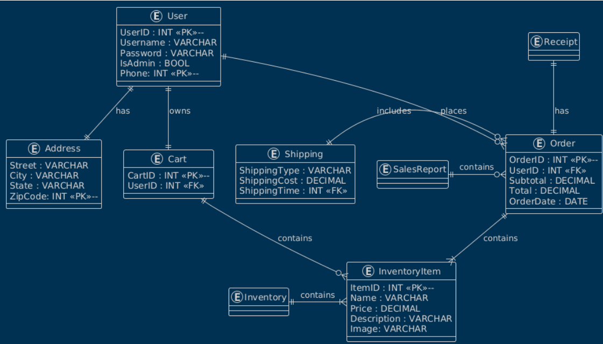

# Technical Design  
  
  
## A. Implementation Languages  
### What did we choose and why?
- Python [(documentation can be found here)](https://docs.python.org/3.13/)
    - Widely used
    - Easily understandable syntax
    - Plethora of open-source libraries
    - Highly Versatile
    - Allows us to use the Flask framework
    - Can be run on most machines
    - Thought the dev team would be most comfortable with this one out of C#, Java, and Python
- HTML [(documentation can be found here)](https://html.spec.whatwg.org/multipage/)
    - Widely used
    - Used for building screens in Flask
    - It is the standard markup language for web pages
    - Easy to learn
    - HTML 5 is supported by nearly every browser
    


### Resources:  
- Python
    - [Official Python tutorial](https://docs.python.org/3/tutorial/index.html) (however, the one by [W3Schools](https://www.w3schools.com/python/default.asp) may be more digestible).
    - Here is a [video tutorial](https://youtu.be/kqtD5dpn9C8?si=EqYCUyNkuxOwwOyL) if you prefer that.

- HTML
    - W3C - one of the organizations that maintains HTML - has an excellent HTML tutorial on their website [W3Schools](https://www.w3schools.com/html/).  
    - Here is a [video tutorial](https://youtu.be/qz0aGYrrlhU?si=jb5wg_vrxS3lr33E) if you prefer that.
    
- Extra help
    - [Geeks for Geeks](https://www.geeksforgeeks.org/) has high quality, concise articles on almost every programming topic; they are an excellent resource for coders of all experience levels.  
    - You can never go wrong with searching [Stack Overflow](https://stackoverflow.com/questions). There is a high chance that someone there has asked your exact question before, and has gotten multiple, very good, answers. 
- I highly recommend using a [JetBrains IDE](https://www.jetbrains.com/) for this project, as you are provided with a license. 

---  
  
## B. Implementation Framework(s)  
### What did we choose and why?
- Flask [(documentation can be found here)](https://flask.palletsprojects.com/en/stable/)
    - Widely used
    - Extensive documentation & community support
    - Similar syntax to python
    - Fast and efficient
    - Flexible
    - Good for prototyping and rapid testing
    - Our only choice for a python framework in this project
- Bootstrap [(documentation & installation can be found here)](https://getbootstrap.com/docs/5.3/getting-started/introduction/)
    - Widely used
    - Extensive documentation & community support
    - Extremely useful for creating webpages
    - Contains many useful premade classes and templates
    - Does much of the CSS for us
    - Very Flexible
    - Quick prototyping
    - Useful for event-driven programming

### Resources:  
- Flask
    - Here is a [good article on the benefits of Flask](https://medium.com/@lauren-fox/why-should-you-use-flask-framework-for-web-development-f5a7233e17a6).  
    - Instructions for flask installation can be found [here](https://flask.palletsprojects.com/en/stable/installation/).  
    - [This playlist](https://youtube.com/playlist?list=PLJJcOjd3n1Zddc1RmIhkjmND7qKS6WGiC&si=fvHHbvakO0MJvBoZ) is an excellent tutorial on creating a python web app using flask.
  
- Bootstrap
    - Here is a [good article on the benefits of bootstrap](https://www.clarity-ventures.com/blog/benefits-of-using-bootstrap-for-web-design).  
    - Here is a [list of all bootstrap classes](https://www.w3schools.com/bootstrap/bootstrap_ref_all_classes.asp).  
    - Here are a few bootstrap tutorials: [W3Schools](https://www.w3schools.com/bootstrap5/), [GeeksforGeeks](https://www.geeksforgeeks.org/bootstrap/bootstrap-tutorial/), [Web Dev Simplified](https://youtu.be/Jyvffr3aCp0?si=h6564wBFPQ56axJZ).


  
---  
  
## C. Data Storage Plan  
### We chose JSON as our data storage language    
#### Why JSON? [(documentation can be found here)](https://www.json.org/json-en.html)  
- Widely used in industry
- Can be easily parsed into python
- Very readable syntax that is reminiscent of python
- Based on JavaScript, so is highly compatible with HTML  

### How will we store our data?
- We will have a database.json file in the same directory as the rest of the program
- database.json will contain all data for this project
- We will use the JSON module for parsing JSON data from our database into python
    - ex: with open("database.json", 'r') as f:  
  database = **json.load(f)**
- We will use the JSON module for updating values in our database
    - ex: with open("database.json", 'w') as f:  
  **json.dump(database, f, indent=4)**
  

  
---  
  
## D. Entity Relationship Diagram
```
@startuml
!theme blueprint

entity "User" as User {
  
UserID : INT <<PK>>--
Username : VARCHAR
Password : VARCHAR
IsAdmin : BOOL
Phone: INT <<PK>>--

}

entity "Address" as Address {

Street : VARCHAR 
City : VARCHAR
State : VARCHAR
ZipCode: INT <<PK>>--

}

entity "InventoryItem" as InventoryItem {
  
ItemID : INT <<PK>>--
Name : VARCHAR
Price : DECIMAL
Description : VARCHAR

}

entity "Cart" as Cart {
  
CartID : INT <<PK>>--
UserID : INT <<FK>>

}


entity "Order" as Order {
  
OrderID : INT <<PK>>--
UserID : INT <<FK>>
Subtotal : DECIMAL
Total : DECIMAL
OrderDate : DATE
}

entity "OrderItem" as OrderItem {
  
OrderID : INT <<FK>>
ItemID : INT <<FK>>
--
PriceAtPurchase : DECIMAL
}

entity "Receipt" as Receipt{

}

entity "SalesReport" as SalesReport {

}

entity "Inventory" as Inventory {

} 

entity "Shipping" as Shipping {

ShippingType : VARCHAR
ShippingCost : DECIMAL 
ShippingTime : INT <<FK>>

}

' ===========================
' Relationships (Crow's Foot)
' ===========================

User ||--|| Cart : owns 
Cart ||--o{ InventoryItem : contains
SalesReport ||-o{ Order : contains
Shipping ||-o{ Order : includes
User||--|| Address : has 

User ||--o{ Order : places
Order --o{ OrderItem : contains
Receipt ||--|| Order: has 
InventoryItem --o{ OrderItem : purchased
Inventory ||-|{ InventoryItem : contains
```
---  



## E. Entity/Field Descriptions  
  
---  
  
## F. Data Examples  
  
---  
  
## G. Database Seed Data  
  
---  
  
## H. Authentication and Authorization Plan  
### Our method for identifying Admins will be quite simple:
- User objects will have a Boolean attribute **"isAdmin"**.
- "isAdmin" will be true **only for user accounts that have been 
transformed into an admin**.
- Upon account creation or login, **a session will be created** using
the flask session functionality.
- The **"secret_key"** for the session will be a **randomly generated string**,
for this we will use secrets.token_hex() from the [secrets module](https://docs.python.org/3/library/secrets.html).
- Upon account creation, a key **"isAdmin"** will be added to the 
session and set to **false**.
- Upon login, a key **"isAdmin"** will be added to the session with the value of
either **true or false**, **depending on the "isAdmin"
value of the account** that the user logged-in to. 
- Events that lead to admin-only pages **will not render** the page **unless** 
the user session **"isAdmin" variable is true**.
- Events that execute admin-only functions (such as a RunSalesReport
button being clicked) **only execute the function(s) when the user 
session "isAdmin" variable is true**.

### For account authentication:
- **When an account is created**, a new user object is added to the JSON 
file with the password and unique username the user entered.
- **The password is stored as a hashed value**. For this we will use the **[Passlib
library](https://passlib.readthedocs.io/en/stable/#getting-started)** and the 
hash functionality, **specifically with 
[sha256_crypt](https://passlib.readthedocs.io/en/stable/lib/passlib.hash.sha256_crypt.html)**.
- The new user object will be created with **hashed_pw as the password value**,
which will be defined like so: **"hashed_pw = sha256_crypt.hash(password)"**
where "password" is the password entered by the user.
- **After clicking "Log In" on the login page**, the system will retrieve the 
password of the user object whose username matches the one entered.
- **The system will verify that the correct password was entered** by passing
the hashed password associated with the user object, and the entered password
into **sha256_crypt.verify(password, hashed_pw)**
- If the .verify() returns true, **the user is logged into the account**.
- As a small security measure; **any password fields** in HTML forms should be of
**type="password"** so that the passwords are disguised while being entered.
  
---  


  
## I. Coding Style Guide  

### Python Style Guidelines

- Use snake_case for variables and functions
load_inventory_data()

- Use PascalCase for classes
UserAccount

- Follow PEP 8: 4 spaces, no tabs.

- Keep functions small and focused.

- Use clear variable names & avoid single-letter names.

- Split large features into modules (routes/, models/, etc.).

- Only add comments when needed. Clean code > heavy commenting.

- Official Python style guide: https://peps.python.org/pep-0008/

### Flask Style Guidelines

- Each route should handle one job.

- Keep database logic in models/helpers - not in routes.

- Use Jinja templates, not raw HTML inside Python.

- Route names should clearly describe the action:
show_main_page(), convert_to_admin(), process_checkout()

### HTML Style Guidelines

- Use semantic HTML (`<main>`, `<section>`, `<footer>`).

- Indent properly and keep the structure clean.

- Avoid inline styles.

- Use meaningful class names.

### Bootstrap Style Guidelines

- Use Bootstrap’s grid system (row, col) for all layouts.

- Make use of Bootstrap components (cards, navbars, buttons) whenever possible for quicker and more consistent UI creation.

- Let Bootstrap handle responsiveness — avoid hardcoded sizes.

- Keep UI consistent by reusing Bootstrap classes.

### Version Control Guidelines

- Write descriptive commit messages.

- Never commit API keys or credentials.

- Use feature branches, then merge into main after review.

- Keep pull requests small for easy review.
  
---  
  
## Technical Design Presentation
